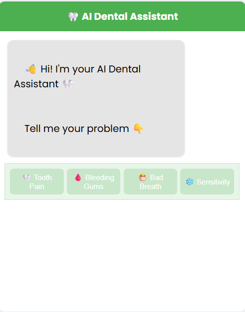
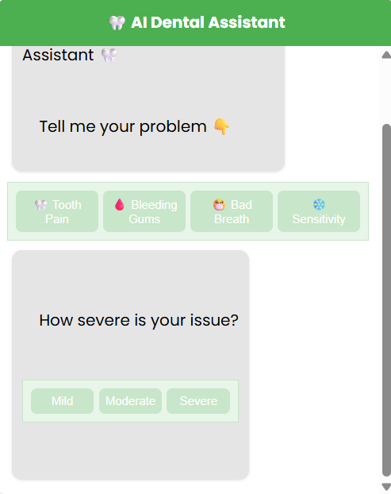
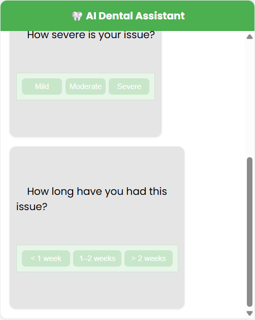
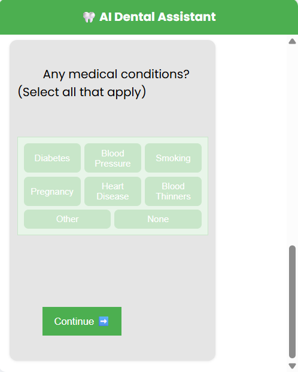
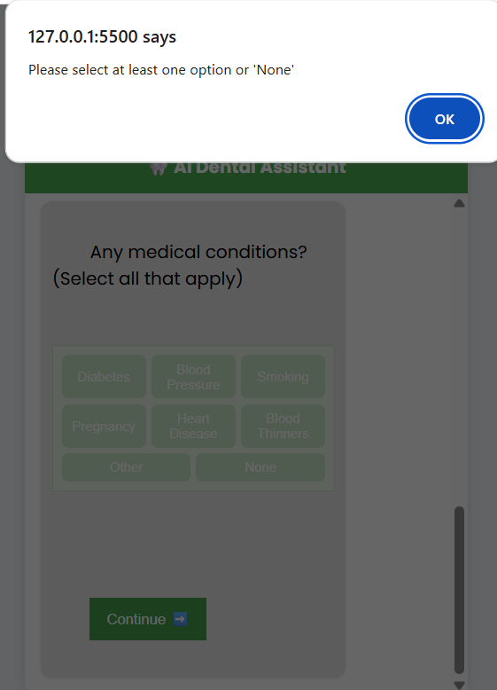
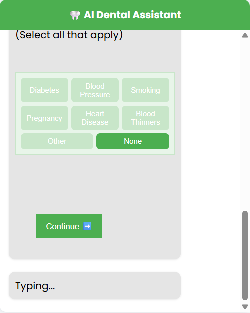

# 🦷 AI Dental Assistant

AI-assisted dental symptom assessment chatbot prototype designed to reduce patient uncertainty and guide users toward informed dental care decisions.

## Preview

### Chatbot Introduction

### Symptom Severity

### Symptom Duration Flow

### Medical Condition Assessment

### response - if no option selected

### response

## Overview

This project explores how conversational healthcare interfaces can make early dental guidance more approachable, interactive, and patient-friendly.

Many patients delay dental consultations because they are unsure about:
- the seriousness of symptoms
- what steps to take next
- whether immediate care is needed

This chatbot prototype aims to reduce that uncertainty through a guided assessment experience.

## Features

### Symptom Selection
Users can choose common dental concerns such as:
- Tooth Pain
- Bleeding Gums
- Bad Breath
- Sensitivity

### Severity Assessment
Interactive severity selection:
- Mild
- Moderate
- Severe

### Duration Tracking
Users can indicate symptom duration:
- < 1 week
- 1–2 weeks
- > 2 weeks

### Medical Condition Screening
Healthcare-aware intake flow including:
- Diabetes
- Blood Pressure
- Heart Disease
- Smoking
- Pregnancy
- Blood Thinners

## Project Goals

- Reduce patient uncertainty
- Improve accessibility through conversational UX
- Encourage timely dental consultation
- Create a clean healthcare-focused interface
- Explore AI-assisted healthcare workflows

## Tech Stack

- HTML
- CSS
- JavaScript

## UI/UX Focus

The project follows a:
- Mobile-first layout
- Conversational chatbot interaction model
- Minimal healthcare UI design
- Clean card-based structure
- Patient-friendly experience

## Future Improvements

Planned enhancements:
- AI-generated responses
- Risk assessment reports
- Appointment booking integration
- Previous report tracking
- Medication monitoring
- Doctor dashboard integration

## Disclaimer

This project is a healthcare UX/UI prototype created for educational and portfolio purposes only.  
It is not intended for real medical diagnosis or treatment.

## Author

### Susreesha Vanam
Healthcare UX / Product Design  
BDS + BCA Background  
Focused on AI-assisted healthcare experiences
